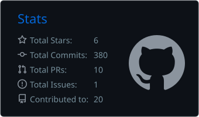
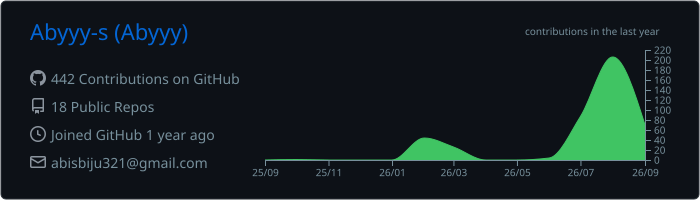
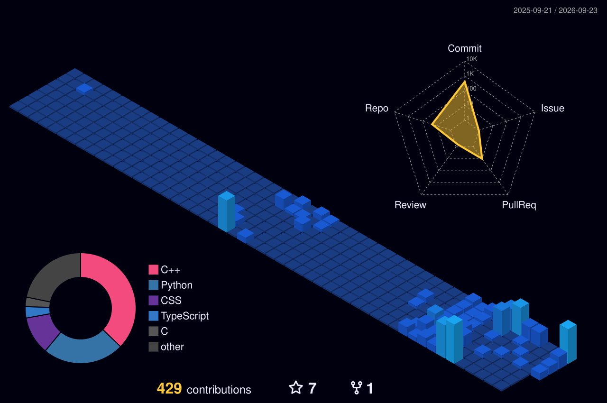
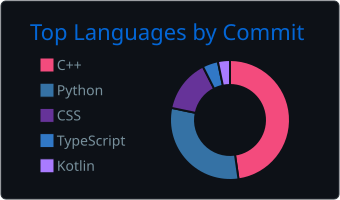
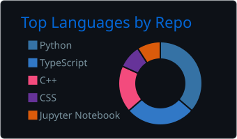
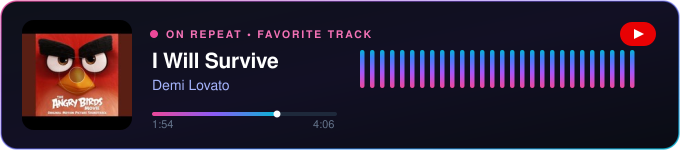

<!-- TOP INTRO GREETING (Raymo111 Style Intro GIF with Aby's Content) -->

  

<!-- HERO SECTION: LEFT-ALIGNED TYPING & BIO, RIGHT-ALIGNED CODER GIF (8BitJonny Style) -->

  

<ul>
  <li> ♟️ <b>Current Research:</b> <a href="https://github.com/Abyyy-s/Rust-Chess_Engine"><b>Rust-Chess_Engine</b></a> — High-performance chess engine in Rust exploring bitboard representations, Alpha-Beta pruning, iterative deepening, and parallel search architecture. 🦀</li>
  <li> ⚡ <b>Flagship Project:</b> <a href="https://github.com/Abyyy-s/ChronoWall"><b>ChronoWall</b></a> — C++17 dynamic wallpaper daemon parsing GNOME XML schemas on Cinnamon.</li>
  <li> 🎨 <b>Companion:</b> <a href="https://github.com/Abyyy-s/ChronoWall-Wallpapers"><b>ChronoWall-Wallpapers</b></a> — Curated dynamic wallpaper packages.</li>
  <li> 🎓 <b>Education:</b> B.Tech Computer Science Engineering (AI & ML) at <b>College of Engineering Chengannur</b>.</li>
  <li> 🔬 <b>Graph / Topology:</b> <a href="https://github.com/Abyyy-s/hypergrid-lattice-core"><b>hypergrid-lattice-core</b></a> — Planar-topology analyzer & Hamiltonian trajectory optimizer.</li>
  <li> 🩸 <b>Side Project:</b> <a href="https://github.com/Abyyy-s/Blood_bank"><b>Life Link</b></a> — AI-assisted blood bank management system.</li>
  <li> 💻 <b>Tech Stack:</b> Rust, C++17/20, Linux, Python, JavaScript, MySQL, Flask, Git.</li>
  <li> 📫 <b>How to reach me:</b> <a href="mailto:abisbiju321@gmail.com">abisbiju321@gmail.com</a></li>
</ul>

  

  
  
  
  
  
  
  

 

---

## 📊 GitHub Stats & 3D Contribution Skyline

  
  

<!-- 3D CONTRIBUTION SKYLINE & ACTIVITY RADAR (Yoshi389111 Style) -->

  <picture>
    <source media="(prefers-color-scheme: dark)" srcset="./profile-3d-contrib/profile-night-view.svg">
    <source media="(prefers-color-scheme: light)" srcset="./profile-3d-contrib/profile-green-animate.svg">
    
  </picture>

---

## 🏆 GitHub Trophies & Achievements

  

  
  &nbsp;&nbsp;&nbsp;&nbsp;
  
  &nbsp;&nbsp;&nbsp;&nbsp;
  
  &nbsp;&nbsp;&nbsp;&nbsp;
  

---

## 📈 Isometric Calendar & Languages Activity

  

  
  

---

## 🎵 Music & On Repeat

  

---

## 👾 Contribution Snake

  <picture>
    <source media="(prefers-color-scheme: dark)" srcset="https://raw.githubusercontent.com/Abyyy-s/Abyyy-s/output/github-contribution-grid-snake-dark.svg">
    <source media="(prefers-color-scheme: light)" srcset="https://raw.githubusercontent.com/Abyyy-s/Abyyy-s/output/github-contribution-grid-snake.svg">
    
  </picture>

---

  

