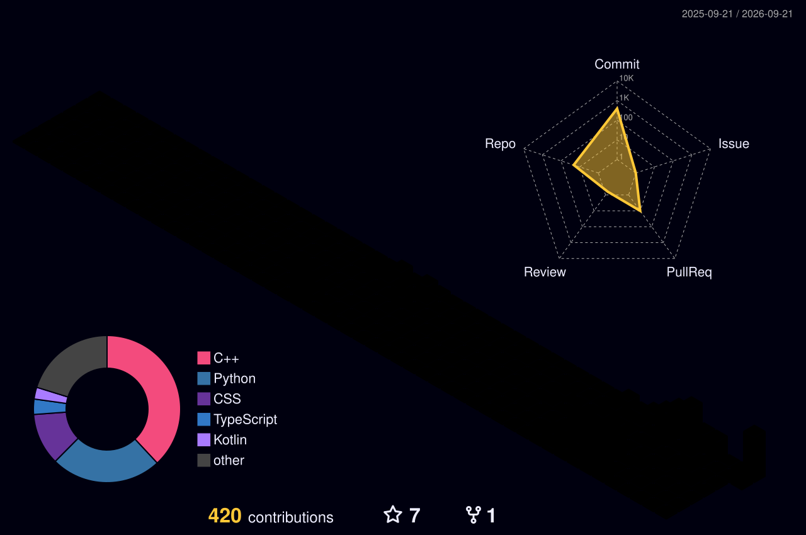

# ⚡ Aby S Biju
### Systems & Low-Level Engineer · Applied AI · Undergrad at College of Engineering Chengannur

  
  
  
  

---

### 🧊 3D Contribution Landscape
<a href="https://github.com/Abyyy-s">
  <picture>
    <source media="(prefers-color-scheme: dark)" srcset="./profile-3d-contrib/profile-night-rainbow.svg">
    <source media="(prefers-color-scheme: light)" srcset="./profile-3d-contrib/profile-night-rainbow.svg">
    
  </picture>
</a>

---

### 👾 Contribution Grid Snake
<picture>
  <source media="(prefers-color-scheme: dark)" srcset="https://raw.githubusercontent.com/Abyyy-s/Abyyy-s/output/github-contribution-grid-snake-dark.svg">
  <source media="(prefers-color-scheme: light)" srcset="https://raw.githubusercontent.com/Abyyy-s/Abyyy-s/output/github-contribution-grid-snake.svg">
  
</picture>

---

### 📊 Deep Engineering Telemetry & Habits

---

### 🚀 Key Projects
- **[`hypergrid-lattice-core`](https://github.com/Abyyy-s/hypergrid-lattice-core)**: Asynchronous planar-topology analyzer & bounded Hamiltonian trajectory optimizer for embedded runtimes ($\mathcal{O}(V + E)$).
- **[`ChronoWall`](https://github.com/Abyyy-s/ChronoWall)**: High-performance C++17 daemon parsing GNOME dynamic XML schemas to schedule wallpaper transitions on Cinnamon.
- **[`Life Link`](https://github.com/Abyyy-s/Blood_bank)**: AI-assisted blood bank inventory and emergency request prioritization platform.

---

Built & maintained by <a href="https://github.com/Abyyy-s">Aby S Biju</a>

